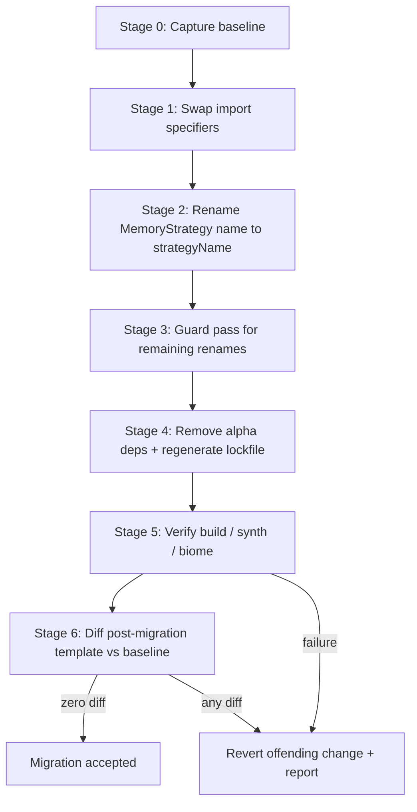

# Design Document

## Overview

This design describes a behavior-preserving migration of the project from the alpha AWS CDK
Bedrock AgentCore module (`@aws-cdk/aws-bedrock-agentcore-alpha`) to the stabilized module
shipped inside `aws-cdk-lib` as `aws-cdk-lib/aws-bedrockagentcore`, following
[AWS CDK PR #37876](https://github.com/aws/aws-cdk/pull/37876).

The migration is intentionally minimal and surgical. It touches exactly three files plus the
lockfile:

- `lib/constructs/agent-core.ts` — value import of the AgentCore module; uses `Memory`,
  `MemoryStrategy`, `Runtime`, `AgentRuntimeArtifact`.
- `lib/constructs/api-gw.ts` — type-only import of the AgentCore module; uses `Runtime` as a
  prop type.
- `package.json` — declares the two alpha packages as dependencies.
- `pnpm-lock.yaml` — pinned resolutions for the alpha packages.

The defining constraint of this feature is **behavior preservation**: the synthesized
CloudFormation template must be byte-for-resource identical before and after the migration.
Because the alpha and stable modules emit the same underlying L1 (`Cfn*`) resources, swapping the
import specifier and applying the member renames should produce an identical template. The design
therefore centers verification on a **baseline-then-diff** strategy rather than on new runtime
logic.

### Scope

In scope:
- Replacing the alpha module specifier with the stable specifier while preserving each import's
  value/type-only form and the `agentcore` local binding.
- Renaming the `MemoryStrategy` member `name` → `strategyName` in the four commented-out strategy
  configurations.
- A guard pass for the remaining PR #37876 breaking-change renames (none currently used).
- Removing both alpha packages from `package.json` and regenerating the lockfile.
- Verifying build, synth, Biome, and CloudFormation template equivalence.

Out of scope:
- Any change to resource names, environment variables, durations, or IAM grants.
- Enabling any of the currently commented-out `MemoryStrategy` configurations.
- Any change to Python (`src/agent/`) code or other constructs.

### Key Research Findings

- **Module graduation, not rewrite.** PR #37876 stabilizes the AgentCore constructs into
  `aws-cdk-lib/aws-bedrockagentcore`. The public construct surface used by this project
  (`Memory`, `MemoryStrategy`, `Runtime`, `AgentRuntimeArtifact`) carries over; the breaking
  changes are member/type renames, not removed constructs.
- **The relevant rename for this project is `IMemoryStrategy.name` → `strategyName`.** All four
  `MemoryStrategy.using*` factory configs in `agent-core.ts` accept a common-props object whose
  `name` key is renamed to `strategyName`. These configs are currently commented out, so the
  rename is a textual edit inside comments that keeps them valid for future re-enablement.
- **The other PR breaking changes are not used here.** `metric()` signature change,
  `EvaluatorReference`/`EvaluatorReferenceBindResult`, `ApiKeyCredentialProvider*` props renames,
  gateway/browser/code-interpreter `name` renames, and `OverrideConfig.model` typing are absent
  from the codebase. Requirement 3 is a completeness guard verified by a repository-wide search
  that is expected to find zero matches.
- **`@aws-cdk/aws-bedrock-alpha` is already dormant.** Its imports are commented out in
  `knowledge-base.ts` and `estate-knowledge-base.ts`, so it can be removed alongside the
  AgentCore alpha package once a search confirms no live references remain.
- **Package management.** The project uses pnpm (`pnpm@11.7.0`) with `pnpm-lock.yaml`. Dependency
  removal must be followed by a lockfile regeneration (`pnpm install`) so the lockfile no longer
  pins the alpha packages.

## Architecture

The migration is a sequenced, verifiable transformation pipeline. Each stage has an explicit
checkpoint, and a failure at any checkpoint halts the pipeline and triggers the rollback path for
that stage.



### Stage breakdown

- **Stage 0 — Capture baseline.** Run `pnpm cdk synth` on the unmodified codebase and preserve the
  resulting templates for every stack (e.g. `cdk.out/*.template.json`) to a baseline location that
  is not overwritten by later synths. This is the reference for the Stage 6 equivalence check.
- **Stage 1 — Swap import specifiers.** In each affected file, replace only the module specifier
  string `@aws-cdk/aws-bedrock-agentcore-alpha` with `aws-cdk-lib/aws-bedrockagentcore`. Preserve
  the `import * as agentcore` form in `agent-core.ts` and the `import type * as agentcore` form in
  `api-gw.ts`, and preserve the `agentcore` binding in both.
- **Stage 2 — Member rename.** In `agent-core.ts`, rename the `name:` key to `strategyName:` in
  each of the four commented `MemoryStrategy.using*` configs, preserving each assigned string value
  and quoting verbatim and leaving `namespaces` / `reflectionConfiguration` untouched.
- **Stage 3 — Guard pass.** Search the codebase for the remaining PR #37876 renamed members/types.
  Expected result: zero matches, so no edits. If any match is found, apply the corresponding rename
  from Requirement 3.
- **Stage 4 — Dependency removal.** Confirm (via search) that no live import of either alpha
  package remains, remove both entries from `package.json` dependencies, and run `pnpm install` to
  regenerate `pnpm-lock.yaml`. Retain `aws-cdk-lib`.
- **Stage 5 — Verify toolchain.** Run `pnpm run build` (tsc --noEmit), `pnpm cdk synth`, and
  `pnpm biome:dry`, each expected to exit 0.
- **Stage 6 — Template equivalence.** Diff the freshly synthesized templates against the Stage 0
  baseline; the diff must be empty.

### Rationale

Capturing the baseline first (Stage 0) is essential: once dependencies are removed the alpha module
can no longer be synthesized, so the only trustworthy reference is a template captured beforehand.
Ordering source edits (Stages 1–3) before dependency removal (Stage 4) keeps the project in a
compilable state at each step and makes the source of any build failure unambiguous.

## Components and Interfaces

This is a code-and-config migration, so the "components" are the files transformed and the
verification commands, rather than runtime modules.

### Affected source files

| File | Import form (before → after) | Members used | Edit |
| --- | --- | --- | --- |
| `lib/constructs/agent-core.ts` | `import * as agentcore from "@aws-cdk/aws-bedrock-agentcore-alpha"` → `... from "aws-cdk-lib/aws-bedrockagentcore"` | `Memory`, `MemoryStrategy`, `Runtime`, `AgentRuntimeArtifact` | Specifier swap + 4× `name`→`strategyName` in comments |
| `lib/constructs/api-gw.ts` | `import type * as agentcore from "@aws-cdk/aws-bedrock-agentcore-alpha"` → `... from "aws-cdk-lib/aws-bedrockagentcore"` | `Runtime` (prop type) | Specifier swap only |

### Import transformation contract

The transformation operates only on the module specifier token of matching import statements:

- Match: an import statement whose specifier is exactly `@aws-cdk/aws-bedrock-agentcore-alpha`.
- Action: replace the specifier substring with `aws-cdk-lib/aws-bedrockagentcore`.
- Invariant: every other token of the statement (keyword `import`, optional `type`, `* as`,
  binding `agentcore`) and every non-import line is left byte-for-byte unchanged.

### Package manifest interface

`package.json` `dependencies` loses two keys:

```diff
 "dependencies": {
-  "@aws-cdk/aws-bedrock-agentcore-alpha": "2.259.0-alpha.0",
-  "@aws-cdk/aws-bedrock-alpha": "2.259.0-alpha.0",
   "@aws-lambda-powertools/logger": "^2.33.1",
   ...
   "aws-cdk-lib": "^2.260.0",
```

`aws-cdk-lib` is retained. After the edit, `pnpm install` regenerates `pnpm-lock.yaml`.

### Verification command interface

| Command | Purpose | Success condition |
| --- | --- | --- |
| `pnpm cdk synth` (Stage 0) | Capture baseline templates | Templates written for every stack |
| `pnpm run build` | TypeScript type check | Exit 0, zero errors |
| `pnpm cdk synth` (Stage 5) | Regenerate templates | Exit 0, template per stack |
| `pnpm biome:dry` | Lint/format check | Exit 0, zero errors/warnings |
| template diff | Behavior preservation | Empty diff vs baseline |

## Data Models

### Migration plan (conceptual)

```typescript
type ImportEdit = {
  file: string                  // e.g. "lib/constructs/api-gw.ts"
  fromSpecifier: "@aws-cdk/aws-bedrock-agentcore-alpha"
  toSpecifier: "aws-cdk-lib/aws-bedrockagentcore"
  importForm: "value" | "type-only"   // preserved across the edit
  binding: "agentcore"                // preserved across the edit
}

type MemberRename = {
  file: string
  fromKey: "name"
  toKey: "strategyName"
  // value (string literal incl. quoting) preserved verbatim
}

type DependencyRemoval = {
  package: "@aws-cdk/aws-bedrock-agentcore-alpha" | "@aws-cdk/aws-bedrock-alpha"
  liveReferenceCount: number    // must be 0 before removal proceeds
}
```

### Template equivalence model

The behavior-preservation check compares two CloudFormation template trees:

```typescript
type TemplateComparison = {
  baseline: CloudFormationTemplate   // synthesized at Stage 0
  candidate: CloudFormationTemplate  // synthesized at Stage 5
  // Acceptance: addedResources == removedResources == modifiedResources == 0,
  // and zero changed resource properties or IAM policy statements.
}
```

The comparison is performed per stack. For the AgentCore stack this includes the Memory resource
(notably `expirationDuration` = 7 days), the Runtime resource (all environment variable keys and
values), and all attached IAM managed policies and inline grant statements.

## Verification Approach (Property-Based Testing Not Applicable)

Property-based testing does not apply to this feature, so the Correctness Properties section is
intentionally omitted in favor of snapshot/template-diff verification (see Testing Strategy).

This is an Infrastructure-as-Code (CDK) migration plus a one-shot textual transformation of import
specifiers, a commented-out member rename, and dependency declarations. There is no pure function
with a large or infinite input space over which a "for all inputs X, property P(X) holds" statement
would add value:

- The transformation is applied to a fixed, enumerable set of files (two source files plus
  `package.json`), not to arbitrary generated inputs.
- The strongest correctness guarantee — that infrastructure behavior is unchanged — is exactly a
  **snapshot equivalence** assertion: synth a baseline template, then assert the post-migration
  template is identical. Running this 100 times over randomized inputs would not reveal additional
  bugs because the synth output is deterministic for a fixed codebase.
- The remaining acceptance criteria are configuration/setup checks (build exits 0, synth exits 0,
  Biome exits 0, lockfile contains zero alpha keys), which are best verified by single-execution
  smoke/integration checks.

Accordingly, the Testing Strategy below specifies snapshot (template-diff) tests, single-execution
toolchain checks, and repository-wide search assertions instead of property-based tests.

## Error Handling

| Failure point | Detection | Handling |
| --- | --- | --- |
| Specifier not found / typo in stable specifier | `pnpm run build` reports module-resolution error | Correct the specifier; re-run build (Req 1.5, 5.3). |
| Import form altered (value ↔ type-only) | Build error (`Runtime` used as value, or type used at runtime) | Restore original form, keeping only the specifier changed (Req 1.2). |
| Member rename applied to a non-`name` key | Code review / diff inspection | Revert; rename only `name`→`strategyName` (Req 2.4, 2.5). |
| Live reference to an alpha package still present at removal time | Repository search returns ≥1 match | Retain that package, leave manifest + lockfile unchanged, report the reference to the developer (Req 4.5). |
| Lockfile still pins alpha packages after install | Search `pnpm-lock.yaml` for alpha keys | Re-run `pnpm install`; investigate transitive pins (Req 4.3). |
| Build failure attributable to migration | `pnpm run build` non-zero exit | Fix and re-run until exit 0 (Req 5.3). |
| Synth failure attributable to migration | `pnpm cdk synth` non-zero exit or missing stack template | Fix and re-run until exit 0 with a template per stack (Req 5.5). |
| Biome reports errors/warnings | `pnpm biome:dry` non-zero exit | Apply `pnpm biome:fix` or hand-correct; re-run (Req 5.4). |
| Template diff is non-empty | Stage 6 comparison reports any add/remove/modify | Treat migration as failed, revert the differing change, report the detected difference (Req 6.4). |

The overarching rule: any difference between the post-migration template and the Stage 0 baseline
is treated as a migration failure (not an acceptable change), because the feature's premise is
zero behavioral change.

## Testing Strategy

Property-based testing is not used (see Correctness Properties for rationale). Verification relies
on snapshot/template-diff tests, single-execution toolchain checks, and repository-wide search
assertions.

### 1. Snapshot / template-equivalence test (primary)

This is the highest-value check and directly validates Requirement 6.

- **Baseline capture:** Before any edits, run `pnpm cdk synth` and copy each stack template
  (e.g. `cdk.out/AgentCoreStack.template.json`) to a baseline file that subsequent synths will not
  overwrite.
- **Post-migration synth:** After Stages 1–5, run `pnpm cdk synth` again.
- **Comparison:** Diff each post-migration template against its baseline. The diff MUST be empty —
  zero added, removed, or modified resources, resource properties, or IAM policy statements.
- **Focus assertions:** Explicitly confirm the AgentCore Memory resource retains
  `expirationDuration` of 7 days, the Runtime resource retains every environment variable key and
  value, and all attached managed policies and inline grant statements are unchanged.
- **Tooling:** A JSON deep-equal of the template objects, or `cdk diff` against the baseline, is
  sufficient. (`cdk diff` against a deployed stack is not required; the comparison is template-to-
  template.)

### 2. Toolchain / smoke checks (single execution)

- `pnpm run build` → exit 0, zero TypeScript errors (Req 1.5, 4.6, 5.1, 5.3, 6.5).
- `pnpm cdk synth` → exit 0, produces a template for every defined stack (Req 5.2, 5.5).
- `pnpm biome:dry` → exit 0, zero errors and zero warnings across `bin/ lib/ src/ tests/`
  (Req 5.4).

### 3. Repository-wide search assertions

- After Stage 1: zero occurrences of `@aws-cdk/aws-bedrock-agentcore-alpha` across all source
  files (Req 1.3).
- Stage 3 guard: zero occurrences of the remaining renamed members/types
  (`IGateway.name`, `IGatewayTarget.name`, `BrowserCustom.name`, `CodeInterpreterCustom.name`,
  `ApiKeyCredentialProviderProps`/`ApiKeyCredentialProviderResourceProps`, `EvaluatorReference`/
  `EvaluatorReferenceBindResult`, `metric(` positional dimensions, `OverrideConfig.model`)
  (Req 3.1–3.8).
- After Stage 4: zero live import/require references to either alpha package under
  `bin/`, `lib/`, `src/`, `tests/` (Req 4.1, 4.2, 4.5), and zero occurrences of either alpha
  package as a key in `pnpm-lock.yaml` (Req 4.3).

### 4. Edit-scope verification

- Inspect the per-file diff for `agent-core.ts` and `api-gw.ts` to confirm only import specifiers
  and the four commented `name`→`strategyName` keys changed; every other line is byte-for-byte
  unchanged (Req 1.4, 2.3, 2.4, 6.3).
- Confirm the four `MemoryStrategy` configs remain commented out after the rename (Req 2.2).

### Test execution notes

- All commands are single-execution checks; none are watch-mode. Run `pnpm cdk synth` and the
  other checks with their default (non-watch) behavior.
- The pre-commit hook runs `pnpm biome:dry` and `pnpm ruff:dry`; the Biome check is covered above,
  and `ruff:dry` should remain green because no Python files are touched.
