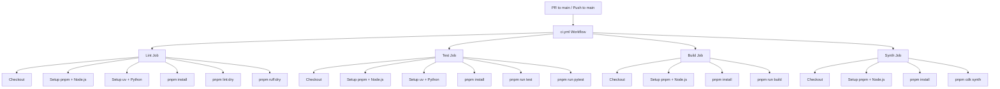

# Design Document: GitHub Actions CI

## Overview

GitHub Actions CI ワークフローを `.github/workflows/ci.yml` に定義し、PR および main ブランチへのプッシュ時に 4 つの並列ジョブ (Lint, Test, Build, Synth) を実行する。各ジョブは独立して実行され、TypeScript (pnpm) と Python (uv) の両方のツールチェーンをセットアップする。依存関係キャッシュにより実行時間を最小化する。

### Design Decisions

1. **単一ワークフローファイル**: 4 ジョブを 1 つの `ci.yml` に集約。管理が容易で、PR ステータスチェックの設定もシンプルになる。
2. **ジョブ間依存なし**: 全ジョブを並列実行し、フィードバック時間を最短化。あるジョブの失敗が他ジョブをブロックしない。
3. **Lint ジョブに TypeScript + Python を統合**: oxlint/oxfmt と Ruff は両方とも軽量な静的解析であり、別ジョブに分割するオーバーヘッド (Runner 起動時間) の方が大きい。
4. **Test ジョブに Vitest + pytest を統合**: 同様の理由で 1 ジョブに統合。両テストスイートとも実行時間が短い。
5. **pnpm/action-setup の built-in キャッシュ**: `pnpm/action-setup` は `actions/setup-node` の `cache: 'pnpm'` と連携し、pnpm store を自動キャッシュする。
6. **astral-sh/setup-uv の built-in キャッシュ**: `astral-sh/setup-uv` は `uv.lock` ベースのキャッシュを自動管理する。

## Architecture

### Workflow Trigger & Job Structure



### Job Matrix

| Job   | Node.js | pnpm   | Python | uv  | Commands                              |
|-------|---------|--------|--------|-----|---------------------------------------|
| Lint  | 24.x   | 10.33.2| 3.14   | ✅  | `pnpm lint:dry`, `pnpm ruff:dry`    |
| Test  | 24.x   | 10.33.2| 3.14   | ✅  | `pnpm run test`, `pnpm run pytest`    |
| Build | 24.x   | 10.33.2| —      | —   | `pnpm run build`                      |
| Synth | 24.x   | 10.33.2| —      | —   | `pnpm cdk synth`                      |

## Components and Interfaces

### Workflow File

- **Path**: `.github/workflows/ci.yml`
- **Name**: `CI`

### Trigger Configuration

```yaml
on:
  push:
    branches: [main]
  pull_request:
    branches: [main]
```

### Shared Setup Pattern

各ジョブで繰り返されるセットアップステップのパターン:

#### TypeScript Setup (全ジョブ共通)

1. `actions/checkout@v6` — リポジトリチェックアウト
2. `pnpm/action-setup@v6` — pnpm 10.33.2 インストール (version は `packageManager` フィールドから自動検出)
3. `actions/setup-node@v6` — Node.js 24.x セットアップ + pnpm キャッシュ有効化
4. `pnpm install --frozen-lockfile` — 依存関係インストール

#### Python Setup (Lint / Test ジョブのみ)

1. `astral-sh/setup-uv@v8` — uv インストール + キャッシュ有効化
2. `actions/setup-python@v6` — Python 3.14 セットアップ (`allow-prereleases: true` が必要、3.14 はプレリリース)
3. `uv sync` — Python 依存関係インストール (暗黙的に `pnpm ruff:dry` / `pnpm run pytest` 内で `uv run` が実行されるため、事前に `uv sync` で仮想環境を準備)

### Job Definitions

#### Lint Job

```yaml
lint:
  name: Lint
  runs-on: ubuntu-latest
  steps:
    - uses: actions/checkout@v6
    - uses: pnpm/action-setup@v6
    - uses: actions/setup-node@v6
      with:
        node-version: "24"
        cache: "pnpm"
    - uses: astral-sh/setup-uv@v8
    - uses: actions/setup-python@v6
      with:
        python-version: "3.14"
        allow-prereleases: true
    - run: pnpm install --frozen-lockfile
    - run: uv sync
    - name: oxlint + oxfmt (TypeScript)
      run: pnpm lint:dry
    - name: Ruff (Python)
      run: pnpm ruff:dry
```

#### Test Job

```yaml
test:
  name: Test
  runs-on: ubuntu-latest
  steps:
    - uses: actions/checkout@v6
    - uses: pnpm/action-setup@v6
    - uses: actions/setup-node@v6
      with:
        node-version: "24"
        cache: "pnpm"
    - uses: astral-sh/setup-uv@v8
    - uses: actions/setup-python@v6
      with:
        python-version: "3.14"
        allow-prereleases: true
    - run: pnpm install --frozen-lockfile
    - run: uv sync
    - name: Vitest (TypeScript)
      run: pnpm run test
    - name: pytest (Python)
      run: pnpm run pytest
```

#### Build Job

```yaml
build:
  name: Build
  runs-on: ubuntu-latest
  steps:
    - uses: actions/checkout@v6
    - uses: pnpm/action-setup@v6
    - uses: actions/setup-node@v6
      with:
        node-version: "24"
        cache: "pnpm"
    - run: pnpm install --frozen-lockfile
    - name: TypeScript type check
      run: pnpm run build
```

#### Synth Job

```yaml
synth:
  name: Synth
  runs-on: ubuntu-latest
  steps:
    - uses: actions/checkout@v6
    - uses: pnpm/action-setup@v6
    - uses: actions/setup-node@v6
      with:
        node-version: "24"
        cache: "pnpm"
    - run: pnpm install --frozen-lockfile
    - name: CDK Synth
      run: pnpm cdk synth
```

## Data Models

この機能にアプリケーションデータモデルは存在しない。ワークフロー YAML の構造自体が「データモデル」に相当する。

### Workflow YAML Structure

```
ci.yml
├── name: CI
├── on:
│   ├── push: { branches: [main] }
│   └── pull_request: { branches: [main] }
├── jobs:
│   ├── lint:     { runs-on, steps[] }
│   ├── test:     { runs-on, steps[] }
│   ├── build:    { runs-on, steps[] }
│   └── synth:    { runs-on, steps[] }
```

### Caching Strategy

| Tool | Cache Mechanism | Cache Key |
|------|----------------|-----------|
| pnpm | `actions/setup-node` の `cache: 'pnpm'` オプション | `pnpm-lock.yaml` ハッシュベース (自動) |
| uv   | `astral-sh/setup-uv` の built-in キャッシュ | `uv.lock` ハッシュベース (自動) |

- pnpm: `pnpm/action-setup` が pnpm をインストールし、`actions/setup-node` の `cache: 'pnpm'` が pnpm store ディレクトリを自動キャッシュする。ロックファイルが変更されない限りキャッシュがヒットする。
- uv: `astral-sh/setup-uv` がデフォルトでキャッシュを有効化する。`uv.lock` のハッシュをキーとして使用する。

## Error Handling

### Job Failure Behavior

- 各ジョブは独立して実行されるため、1 つのジョブが失敗しても他のジョブは継続実行される。
- GitHub Actions のデフォルト動作として、ステップの exit code が非ゼロの場合、そのジョブは即座に失敗する。
- PR のステータスチェックには各ジョブが個別に表示され、どのジョブが失敗したか一目で分かる。

### Specific Failure Scenarios

| Scenario | Behavior |
|----------|----------|
| `pnpm install --frozen-lockfile` 失敗 | ロックファイルと `package.json` の不整合。ジョブ失敗。開発者はローカルで `pnpm install` を実行してロックファイルを更新する必要がある。 |
| `pnpm lint:dry` 失敗 | TypeScript のフォーマット/リント違反。開発者は `pnpm lint:fix` で修正。 |
| `pnpm ruff:dry` 失敗 | Python のフォーマット/リント違反。開発者は `pnpm ruff:fix` で修正。 |
| `pnpm run test` 失敗 | Vitest テスト失敗。テスト出力で失敗箇所を確認。 |
| `pnpm run pytest` 失敗 | pytest テスト失敗。テスト出力で失敗箇所を確認。 |
| `pnpm run build` 失敗 | TypeScript 型エラー。`tsc` 出力で型エラー箇所を確認。 |
| `pnpm cdk synth` 失敗 | CDK テンプレート生成エラー。CDK コンストラクトの問題を確認。 |
| キャッシュミス | 初回実行またはロックファイル変更時。依存関係をフルインストール。次回以降キャッシュされる。 |

## Testing Strategy

### PBT 非適用の理由

この機能は GitHub Actions ワークフロー YAML ファイルの作成であり、宣言的な設定ファイル (IaC に類似) である。純粋関数や入出力のある処理ロジックは存在しないため、Property-Based Testing は適用しない。

### 検証アプローチ

1. **手動レビュー**: ワークフロー YAML の構造・設定値を目視確認
2. **実行検証**: PR を作成して実際にワークフローが正しく動作することを確認
3. **YAML Lint**: ワークフロー YAML の構文が正しいことを確認 (GitHub Actions が自動検証)
4. **段階的検証**:
   - まず 1 ジョブ (例: Lint) のみで PR を作成し、基本動作を確認
   - 全ジョブを追加して並列実行を確認
   - キャッシュヒット/ミスの動作を確認 (2 回目の実行で確認)
