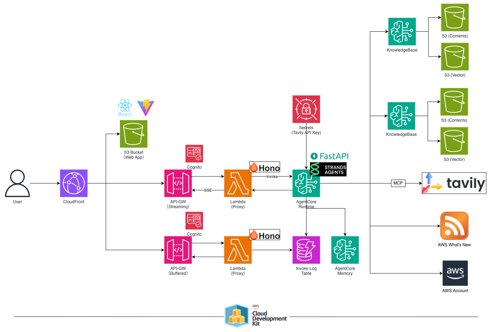

# AWS CDK Agent Core

Amazon Bedrock AgentCore と Strands Agents SDK を活用したマルチエージェントシステムの CDK プロジェクトです。
CloudFront + API Gateway + AgentCore Runtime 上で動作する AI エージェントを、Knowledge Base・メモリ・各種ツール連携とともにデプロイします。

## Architecture



## プロジェクト構成

```
.
├── bin/                        # CDK エントリポイント・パラメータ定義
│   └── parameter.ts            # スタックパラメータ（モデルID、Cognito、API GW設定等）
├── lib/
│   ├── constructs/             # CDK コンストラクト
│   │   ├── agent-core.ts       # AgentCore Runtime / Memory / Secrets Manager
│   │   ├── api-gw.ts           # API Gateway（Buffered / Stream）+ CloudFront 連携
│   │   ├── auth.ts             # Cognito UserPool / Client
│   │   ├── cdn.ts              # CloudFront + S3（フロントエンドホスティング）
│   │   ├── datastore.ts        # DynamoDB（ログテーブル / RSSフィードテーブル）
│   │   ├── knowledge-base.ts   # Bedrock Knowledge Base（S3 Vectors）
│   │   ├── estate-knowledge-base.ts  # 不動産ナレッジベース
│   │   └── rss-retriever.ts    # RSS取得 Lambda + EventBridge Scheduler
│   ├── stack/
│   │   ├── agent-core-stack.ts # メインスタック（全コンストラクトの統合）
│   │   └── sample-stack.ts     # サンプルスタック
│   ├── pipeline-stack.ts       # CodePipeline + Slack通知
│   └── pipeline-app-stage.ts   # パイプラインステージ定義
├── src/
│   ├── agent/                  # AgentCore Runtime アプリケーション（Python / FastAPI）
│   │   ├── main.py             # FastAPI エントリポイント（SSE ストリーミング対応）
│   │   ├── sub_agents.py       # サブエージェント定義
│   │   ├── agent_tools.py      # ツール実装（天気、検索、RSS、KB検索等）
│   │   ├── models.py           # Pydantic / PynamoDB モデル
│   │   └── settings.py         # 環境変数ベースの設定
│   ├── lambda/
│   │   ├── apigw-router/       # API Gateway → AgentCore プロキシ Lambda
│   │   └── rss-retriever.ts    # RSS フィード取得 Lambda
│   └── cloudfront/
│       └── index.js            # CloudFront Functions（リダイレクト処理）
├── tests/                      # テスト（Vitest / pytest）
└── tools/                      # ユーティリティスクリプト
```

## 主要コンポーネント

### エージェント構成（Strands Agents）

メインエージェントが以下のサブエージェントをツールとして呼び出すマルチエージェント構成:

| サブエージェント | 機能 | ツール |
|---|---|---|
| weather_agent | 天気情報取得 | Open-Meteo API / geopy |
| search_agent | Web検索 | Tavily MCP |
| aws_rss_agent | AWS最新ニュース取得 | RSS フィード解析 |
| react_agent | フロントエンド ベストプラクティス | Bedrock Knowledge Base |
| estate_agent | 不動産情報検索 | Bedrock Knowledge Base（不動産） |
| aws_access_agent | AWS環境調査 | strands-tools use_aws |

### AWSリソース

- Amazon Bedrock AgentCore Runtime（コンテナベースのエージェント実行環境）
- Amazon Bedrock Knowledge Base × 2（S3 Vectors / Titan Embed V2）
- Amazon Bedrock AgentCore Memory（セッション管理）
- Amazon API Gateway（Buffered API + Stream API）
- Amazon CloudFront + S3（フロントエンド配信）
- Amazon Cognito（認証）
- Amazon DynamoDB（ログ / RSSフィード）
- AWS Lambda（API ルーター / RSS取得）
- Amazon EventBridge Scheduler（RSS定期取得）
- AWS CodePipeline（CI/CD）
- AWS Chatbot + SNS（Slack通知）

## 技術スタック

- IaC: AWS CDK (TypeScript)
- Agent: Strands Agents SDK (Python) + FastAPI
- LLM: Amazon Nova Pro / Nova Lite
- Embedding: Amazon Titan Embed Text V2
- Runtime: Node.js 24.x / Python 3.14
- パッケージ管理: pnpm (TypeScript) / uv (Python)
- Lint/Format: oxlint + oxfmt (TypeScript) / Ruff (Python)
- テスト: Vitest (TypeScript) / pytest (Python)

## セットアップ

### 前提条件

- Node.js (`.node-version` 参照)
- Python 3.14+
- pnpm
- uv
- AWS CLI（認証設定済み）

### インストール

```bash
pnpm install
```

### デプロイ

```bash
pnpm cdk deploy
```

## 開発コマンド

### CDK

| コマンド | 説明 |
|---|---|
| `pnpm run build` | TypeScript 型チェック |
| `pnpm run test` | Vitest ユニットテスト実行 |
| `pnpm cdk synth` | CloudFormation テンプレート生成 |
| `pnpm cdk deploy` | スタックデプロイ |
| `pnpm cdk diff` | デプロイ済みスタックとの差分確認 |

### アプリケーション

| コマンド | 説明 |
|---|---|
| `pnpm dev` | Lambda プロキシ ローカル起動（Port:3000） |
| `pnpm lint:fix` | TypeScript フォーマット/リント適用 (oxlint + oxfmt) |
| `pnpm ruff:fix` | Python フォーマット/リント適用 |
| `pnpm pytest` | Python テスト実行 |

### AgentCore ローカル起動（Port:8080）

```bash
cd src/agent
uv sync
source .venv/bin/activate
python main.py
```

## Cognito 操作

```bash
export USER_POOL_ID="ap-northeast-1_xxxxxxxxx"
export CLIENT_ID="xxxxxxxxxxxxxxxxxxxxxx"
export COGNITO_USER_NAME="xxxxxxxxxxx"
export COGNITO_PASSWORD="xxxxxxxxxxxx"

# パスワード設定（管理者）
aws cognito-idp admin-set-user-password \
  --user-pool-id ${USER_POOL_ID} \
  --username ${COGNITO_USER_NAME} \
  --password ${COGNITO_PASSWORD} \
  --permanent

# ユーザー有効化
aws cognito-idp admin-enable-user \
  --user-pool-id ${USER_POOL_ID} \
  --username ${COGNITO_USER_NAME}

# 認証トークン取得
aws cognito-idp admin-initiate-auth \
  --user-pool-id ${USER_POOL_ID} \
  --client-id ${CLIENT_ID} \
  --auth-flow "ADMIN_USER_PASSWORD_AUTH" \
  --auth-parameters USERNAME=${COGNITO_USER_NAME},PASSWORD=${COGNITO_PASSWORD}
```

## エンドポイント

| エンドポイント | 用途 |
|---|---|
| `http://localhost:8080/invocations` | AgentCore ローカル（SSE） |
| `http://localhost:3000/invoke` | Lambda プロキシ ローカル |
| `https://<distribution>.cloudfront.net/api/invoke` | 本番（Stream API） |
| `https://<distribution>.cloudfront.net/api/*` | 本番（Buffered API） |
